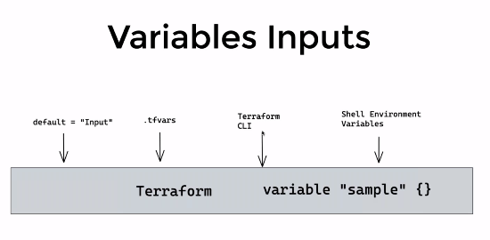

## Terraform Input varibles
- defaule = "Inpute"
- .tfvars
- Terraform CLI
- shell Environment Varibles

## Variables TFVARS
- terraform.tfvars first priority(auto) [example](https://dev.azure.com/sudheerlikeu/D54/_git/terraform?path=/05-variables_inputs/02-terraform-tfvars-and-auto.tfvars-file-example/terraform.tfvars)
- terraform.auto.tfvars second priority (auto) [example](https://dev.azure.com/sudheerlikeu/D54/_git/terraform?path=/05-variables_inputs/02-terraform-tfvars-and-auto.tfvars-file-example/terraform.auto.tfvars)
- dev.tfvars (Manual)  high priority than*.tfvars [example](https://dev.azure.com/sudheerlikeu/D54/_git/terraform?path=/05-variables_inputs/02-terraform-tfvars-and-auto.tfvars-file-example/dev.tfvars)
- prod.tfvars (Manual) high priority than*.tfvars [example](https://dev.azure.com/sudheerlikeu/D54/_git/terraform?path=/05-variables_inputs/02-terraform-tfvars-and-auto.tfvars-file-example/prod.tfvars)
```t
terraform apply -auto-approve -var="key=value"
terraform apply -auto-approve -var-file=dev.tfvars
terraform apply -auto-approve -var-file=prod.tfvars
```

## Varible Precidence 
```t
High Priority to low priority
1. -var 
2. -var-file
3. terraform.auto.tfvars
4. terraform.tfvars
5. Shell_Env_Varibles (least priority) even the varibe is not avillable inn this least priority it will prompt for varible on CLI
6. Ask the User input on CLI
```

