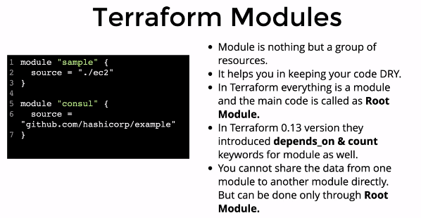

## Terraform Module 
- Terraform module is nothing but a Group of resources
- IT Helps you in keeping your code DRY
- terraform every thing is module and the main coad is called as Root Module
- In terraform 0.13v terraform introduced depends_on & count keywords for modules as well
- module cannot share the Data from one module to another module directly **But can done only through Root module**
